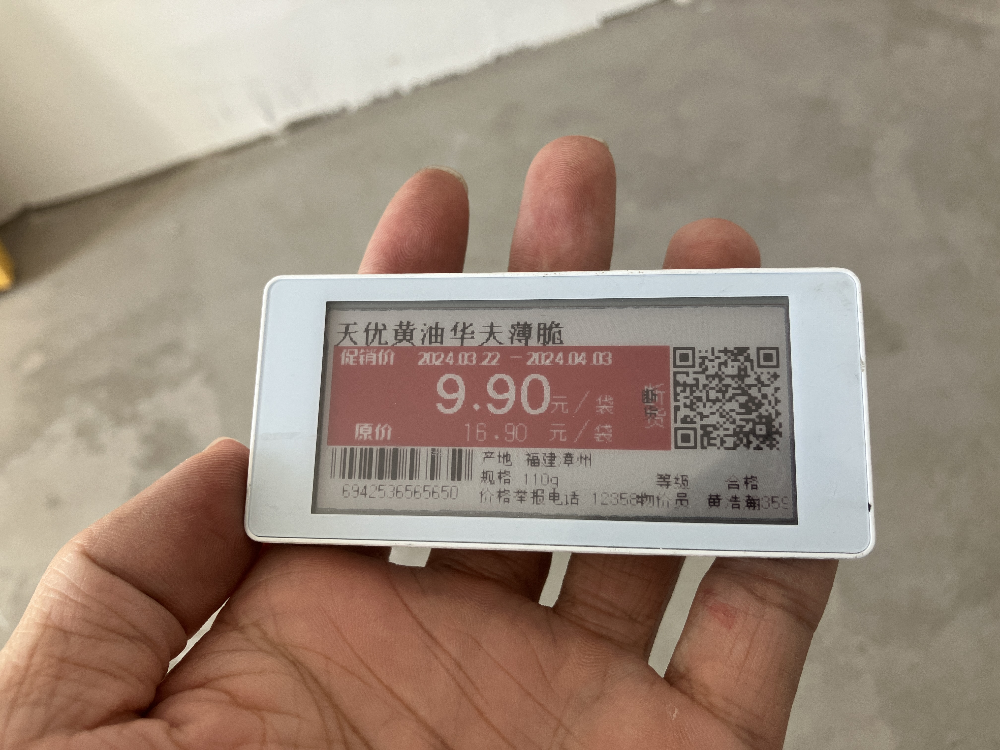
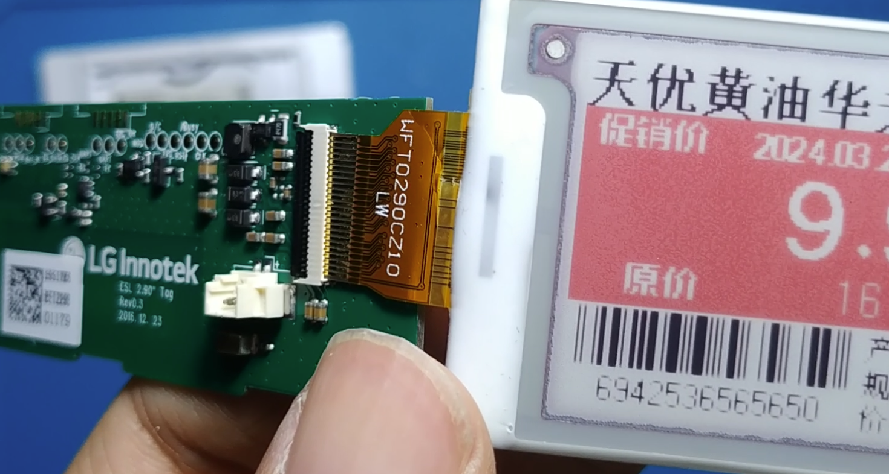
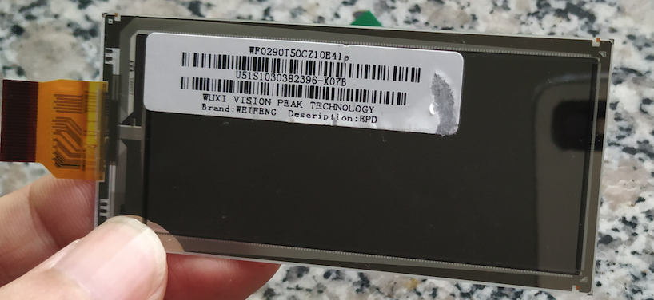
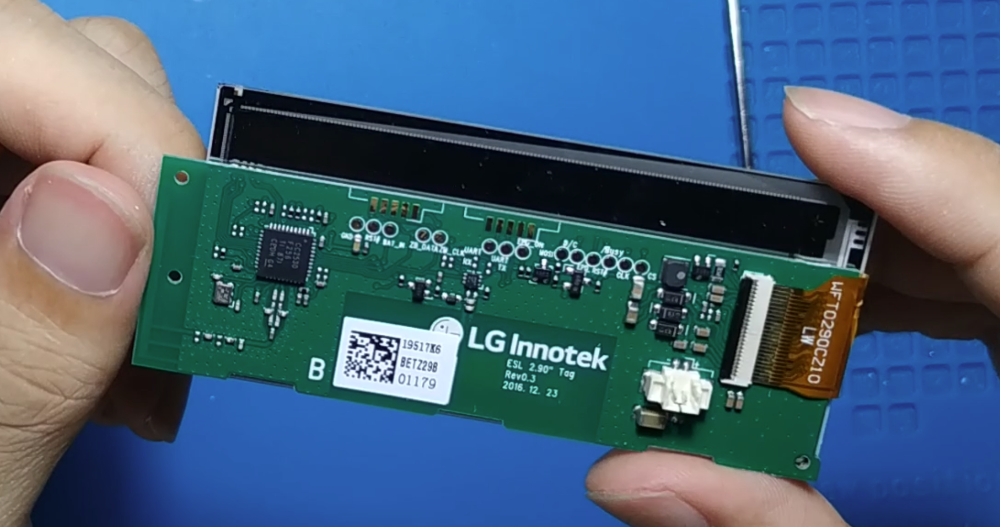
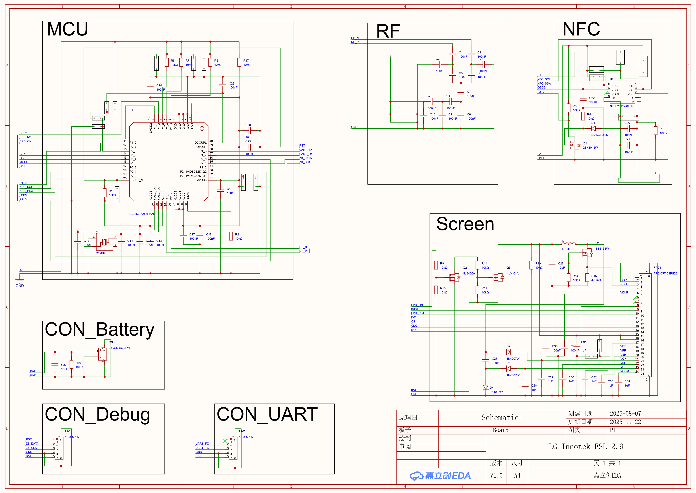

# Introduction

Demo program for LG Innotek 2.9 inch 3-color ESL, SDCC build toolchain.

# The ESL

## Photo

## PCB

## Schematic

# The program

Use object-oriented style, main struct is Epd, the Buffer is a member of Epd.

* `buffer.c`, Buffer struct, operate display buffer.
* `epd.c`, Epd struct, control driver chip.

## Epd functions

<!---->

    void (* read_otp)(struct epd * this) __reentrant;

    void (* update)(
            struct epd * this,
            uint16_t x, uint16_t y, uint16_t width, uint16_t height
            ) __reentrant;
    void (* display)(struct epd * this) __reentrant;

    void (* update_with_data)(
            struct epd * this,
            uint8_t * dtm1_data, uint8_t * dtm2_data,
            uint16_t x, uint16_t y, uint16_t width, uint16_t height
            ) __reentrant;
    void (* display_with_data)(
            struct epd * this,
            uint8_t * dtm1_data, uint8_t * dtm2_data
            ) __reentrant;

    void (* output_partial)(struct epd * this) __reentrant;
    void (* write_dtm2_partial)(
            struct epd * this,
            uint8_t * data
            ) __reentrant;
    void (* write_dtm1_partial)(
            struct epd * this,
            uint8_t * data
            ) __reentrant;
    void (* set_window)(
            struct epd * this,
            uint16_t x, uint16_t y, uint16_t width, uint16_t height
            ) __reentrant;

    void (* clean)(struct epd * this) __reentrant;

    void (* output)(struct epd * this) __reentrant;
    void (* write_dtm2)(struct epd * this, uint8_t * data) __reentrant;
    void (* write_dtm1)(struct epd * this, uint8_t * data) __reentrant;

    void (* sleep)(struct epd * this) __reentrant;

## Buffer functions

<!---->

    void (* draw_string)(
            struct buffer * this,
            void * font,
            const uint8_t * string
            ) __reentrant;

    void (* draw_circle)(
            struct buffer * this,
            uint16_t x_center, uint16_t y_center, uint16_t radius,
            enum point_size point_size,
            enum fill_style fill_style
            ) __reentrant;
    void (* draw_rectangle)(
            struct buffer * this,
            uint16_t x_start, uint16_t y_start,
            uint16_t width, uint16_t height,
            enum point_size point_size,
            enum fill_style fill_style
            ) __reentrant;
    void (* draw_line)(
            struct buffer * this,
            uint16_t x_start, uint16_t y_start,
            uint16_t x_end, uint16_t y_end,
            enum point_size point_size,
            enum line_style line_style
            ) __reentrant;
    void (* draw_point)(
            struct buffer * this,
            uint16_t x, uint16_t y,
            enum point_size point_size,
            enum point_style point_style
            ) __reentrant;

    void (* fill)(
            struct buffer * this
            ) __reentrant;

    void (* set_cursor)(
            struct buffer * this,
            uint16_t cursor_x, uint16_t cursor_y
            ) __reentrant;
    void (* set_color)(
            struct buffer * this,
            enum color color
            ) __reentrant;
    void (* set_dtm_stage)(
            struct buffer * this,
            enum dtm_stage dtm_stage
            ) __reentrant;

    uint8_t (* get_byte)(
            struct buffer * this,
            enum dtm_stage dtm_stage,
            uint16_t ram_offset
            ) __reentrant;

